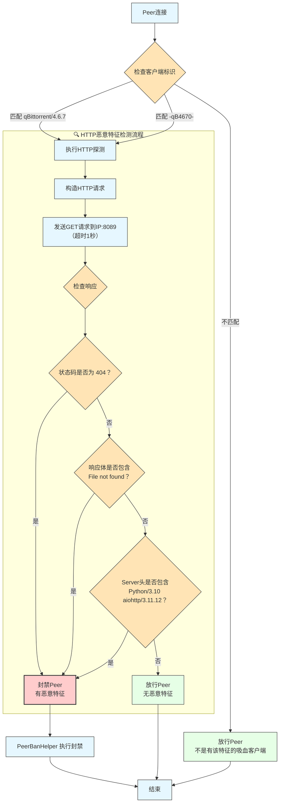

# qB467PeerDetectorPlugin

> [!TIP]
> 本项目代码由 GitHub Copilot Agent 辅助编写
>
> 该插件仅在 PeerBanHelper v9.0.1 版本经过测试，低于 v9.0.0-beta2 的版本可能无法正常工作。

## 简介

本插件专为 **PeerBanHelper** 设计，用于自动识别并封禁使用 `qBittorrent/4.6.7` 客户端或 PeerID 为 `-qB4670-` 的恶意 Peer 节点。

经分析发现，使用 qBittorrent 4.6.7 客户端的这些恶意节点通常运行一个基于 `Python/3.10 aiohttp/3.11.12` 构建的 HTTP 服务，监听在 **8089 端口**（疑似用于集中控制）。该服务在直接访问时返回如下特征：
- 响应头 `Server`: `Python/3.10 aiohttp/3.11.12`
- 响应体内容: `File not found`
- HTTP 状态码: `404`

本插件利用上述特征，实现对"吸血"行为的 qBittorrent 4.6.7 客户端的精准识别与封禁。

## 检测逻辑

当一个 Peer 连接进入时，插件将按以下流程判断是否应予以封禁：

1. 若其 `ClientName` 为 `qBittorrent/4.6.7` 或 `PeerID` 为 `-qB4670-`，则触发进一步探测；
2. 向该 Peer 的 IP 地址发起 HTTP GET 请求至 **端口 8089**（超时 1 秒）；
3. 若满足以下任意一项条件，则判定为恶意节点并执行封禁：
   - HTTP 响应状态码为 `404`
   - 响应体包含 `File not found`
   - 响应头 `Server` 包含 `Python/3.10 aiohttp/3.11.12`

> ✅ 只需满足任一条件即可触发封禁机制，提高检测覆盖率与可靠性。

### 检测流程图



## 使用方法

1. 从 [Releases 页面](https://github.com/your-repo/releases) 下载最新 `.jar` 插件文件；
2. 将其复制到 PeerBanHelper 的 `data/plugins/` 目录下；
3. 重启 PeerBanHelper 服务；
4. 查看日志，若出现以下提示，表示插件已成功加载并运行：
   ```
   [Bootstrap/INFO]: [注册] qB467PeerDetector
   ```

## 依赖项

本插件依赖以下库（部分由 PeerBanHelper 主程序提供）：
- PF4J（插件框架）
- PF4J-Spring（Spring 集成支持）
- OkHttp（HTTP 请求客户端）
- SLF4J（日志门面）
- PeerBanHelper 主程序（运行环境依赖）

## 构建要求

- JDK 21 或更高版本
- Maven 3.10.1 或更高版本

## CI/CD 构建

项目已集成 GitHub Actions 自动化构建流程，详情请参阅：
`.github/workflows/build-plugin.yml`